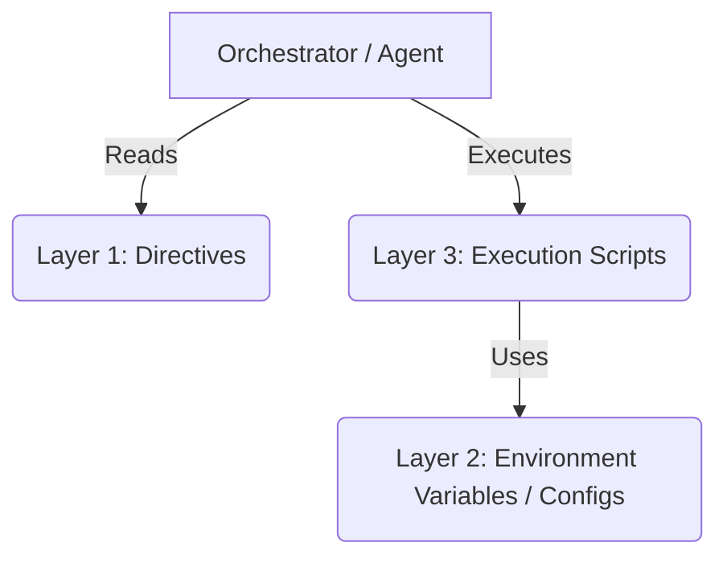

# Travels Automation System

Welcome to the **Travels** automation platform. This project is structured around a **3-Layer Architecture** designed to maximize reliability, separate concerns, and make automation tasks deterministic and testable.

## 3-Layer Architecture

This system separates the orchestration (decision making) from the execution (deterministic actions):



1. **Layer 1: Directives (`directives/`)**
   - Natural language Standard Operating Procedures (SOPs) written in Markdown.
   - They specify: Objectives, Inputs, Step-by-step logic, Outputs, and Edge Cases.
2. **Layer 2: Orchestration (Agent/LLM)**
   - The decision-making layer that routes execution, handles errors, and updates directives based on feedback.
3. **Layer 3: Execution (`execution/`)**
   - Deterministic Python scripts that execute API calls, database operations, web scraping, and file system tasks.
   - Script credentials and configurations are loaded from the environment/`.env` file.

## Getting Started

### 1. Prerequisites
- Python 3.8+
- Virtual environment (recommended)

### 2. Environment Setup
Copy the `.env.template` file to `.env` and configure your API tokens, keys, and paths:
```bash
cp .env.template .env
```

### 3. Folder Layout
```text
.
├── CLAUDE.md          # Agent instructions & operating guidelines
├── README.md           # Project documentation
├── .env.template       # Environment template file
├── directives/        # SOPs and instruction manuals
└── execution/         # Deterministic execution scripts
```
